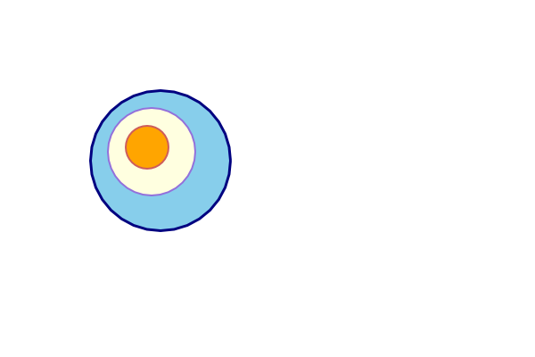
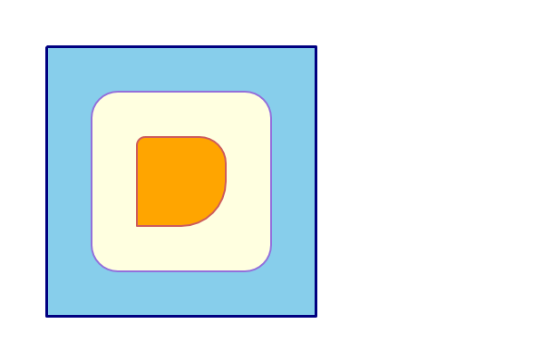
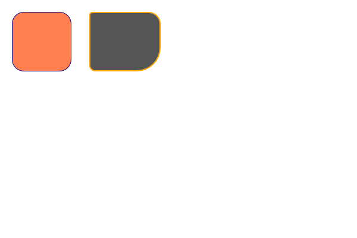
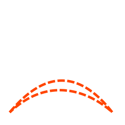
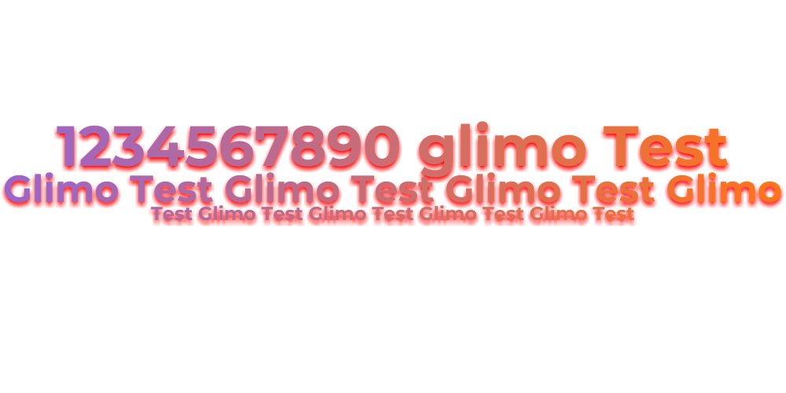
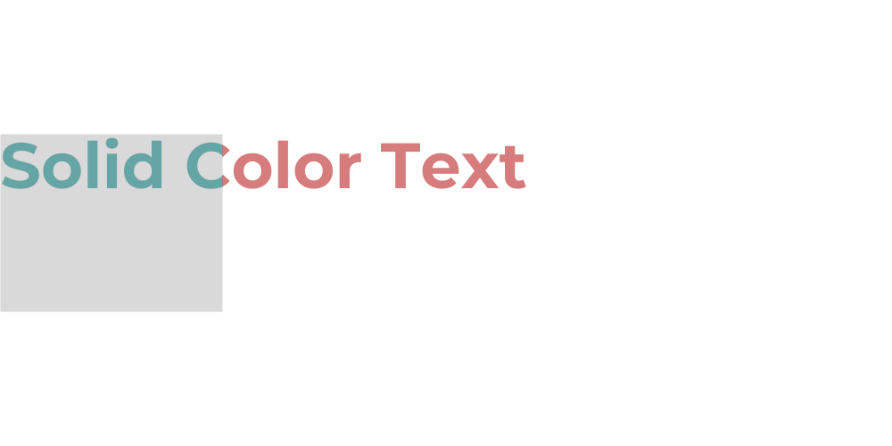

# glimo
🎨 A lightweight and powerful Go library for clear, easy 2D graphics, shapes, text, and auto layout.


---

## 📦 Installation

```bash
go get github.com/krispeckt/glimo
```

---

## 🧩 Features

- Drawing primitives: line, circle, rectangle, text, image (with extended functions)
- Automatic layout
- Layer & frame management
- Visual effects: drop shadow, inner shadow, blur, noise, texture
- Support Blending Mode for colors

---

## 🧠 Project Structure

```tree
├── go.mod
├── go.sum
├── aliases.go
├── colors
│   ├── aliases.go
│   ├── blue.go
│   ├── grayscale.go
│   ├── green.go
│   ├── purple.go
│   ├── red.go
│   └── yellow_orange.go
├── effects
│   ├── drop_shadow.go
│   ├── effects.go
│   ├── inner_shadow.go
│   ├── layer_blur.go
│   ├── noise.go
│   └── texture.go
└── instructions
    ├── auto_layout.go
    ├── circle.go
    ├── image.go
    ├── layer.go
    ├── line.go
    ├── line_engine.go
    ├── point.go
    ├── rectangle.go
    ├── shape.go
    ├── text.go
    ├── text_composite.go
    └── text_wrap.go
```

---

## 🚀 Example Usage

```go
package main

import (
	"github.com/Krispeckt/glimo/colors"
	"github.com/Krispeckt/glimo/instructions"
)

func main() {
	layer := instructions.NewLayer(800, 600)
	layer.LoadInstructions(
		instructions.NewCircle(100, 100, 100).SetFillColor(colors.Red),
		instructions.NewRectangle(100, 250, 200, 100).SetFillColor(colors.Amethyst),
	)

	err := layer.Export("output.png")
	if err != nil {
		panic(err)
	}
}

```

### 🖼️ Examples

<div style="display: flex; flex-wrap: wrap; gap: 8px;">
  
  
  
  
  
  
</div>

---

## 🧪 Run Tests

```bash
go test ./instructions/tests -v
```

---

## 📂 Output Examples

See instructions/tests/output for reference images.
Examples: circle_basic.png, rect_transparency.png, text_gradient_fill_with_shadow.png.

---

## 📜 License

MIT License. See the LICENSE file for details.

---

## 💡 Contributing

Pull requests are welcome.
Before submitting, make sure all tests pass successfully.