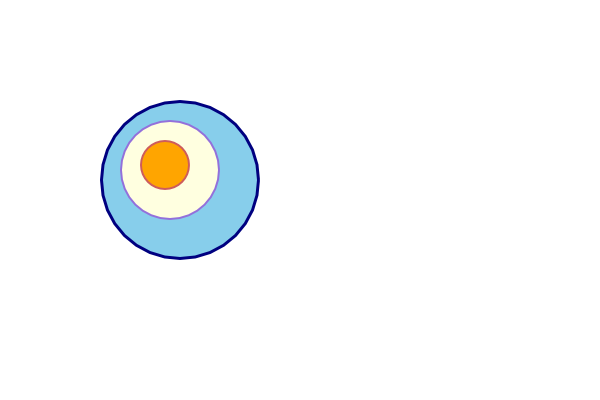
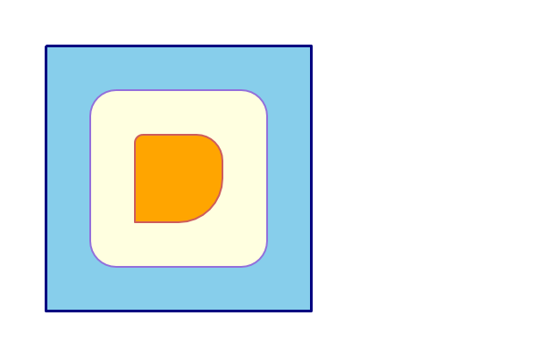
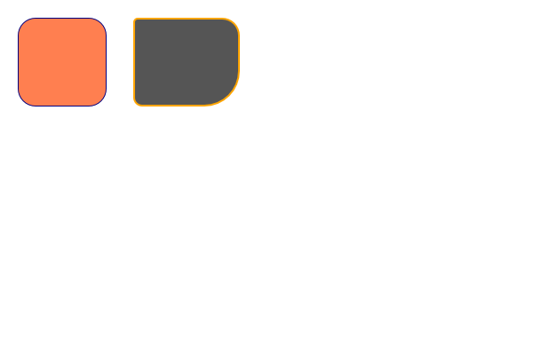
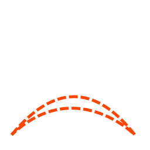
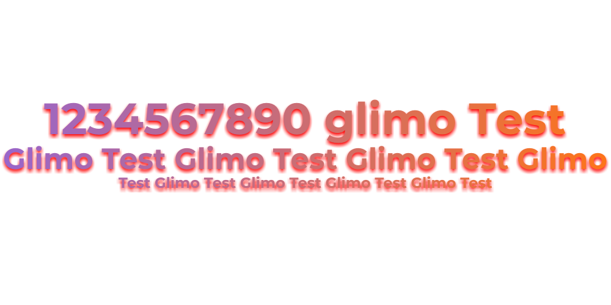
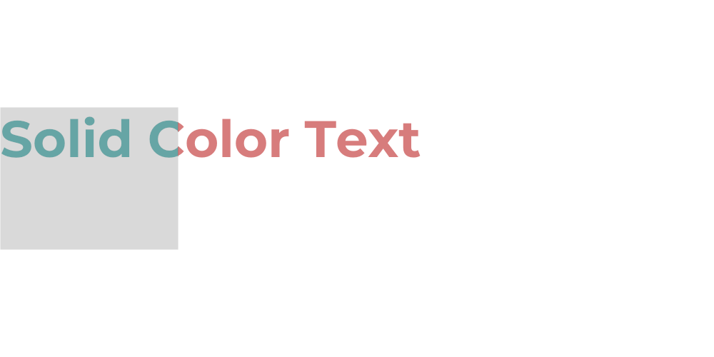

# glimo
A lightweight and powerful Go library for clear, easy 2D graphics, shapes, text, and auto layout.


)


---

## Installation

```bash
go get github.com/krispeckt/glimo
```

---

## Features

- Drawing primitives: line, circle, rectangle, text, image
- Automatic layout (Flexbox-like: direction, wrap, justify, align, gap)
- Layer & frame management
- Visual effects: drop shadow, inner shadow, blur, noise, texture
- Blend modes for colors (20+ CSS-compatible modes)
- Gradients: linear, radial, conic with color stops
- Unicode-aware text wrapping (word & symbol mode, ellipsis, max lines)
- Thread-safe containers (AutoLayout, Group)

---

## Project Structure

```
├── go.mod
├── go.sum
├── aliases.go
├── colors/
│   ├── aliases.go
│   ├── blue.go
│   ├── grayscale.go
│   ├── green.go
│   ├── purple.go
│   ├── red.go
│   └── yellow_orange.go
├── effects/
│   ├── drop_shadow.go
│   ├── effects.go
│   ├── inner_shadow.go
│   ├── layer_blur.go
│   ├── noise.go
│   └── texture.go
└── instructions/
    ├── auto_layout.go
    ├── circle.go
    ├── group.go
    ├── image.go
    ├── layer.go
    ├── line.go
    ├── rectangle.go
    ├── text.go
    ├── text_composite.go
    └── text_wrap.go
```

---

## Font

`render.Font` wraps an OpenType/TrueType font file with pixel-accurate metrics
that match Figma and CSS positioning semantics.

### Loading

```go
import "github.com/Krispeckt/glimo"

// From file
font, err := glimo.LoadFont("Inter-Regular.ttf", 16)

// From embedded bytes
//go:embed Inter-Regular.ttf
var fontData []byte
font, err := glimo.LoadFontFromBytes(fontData, 16)

// Panic variant for init code
font := glimo.MustLoadFont("Inter-Regular.ttf", 16)
```

### Configuration (chainable)

| Method | Description |
|--------|-------------|
| `SetFontSizePt(pt float64)` | Font size in points. At 72 DPI, 1 pt = 1 px. |
| `SetDPI(dpi float64)` | Dots per inch (default 72). At 96 DPI: 1 pt ≈ 1.33 px. |
| `SetLetterSpacingPercent(pct float64)` | Tracking as % of font size. Positive = looser, negative = tighter. |
| `SetAxis(tag string, value float32)` | Set a variable-font design axis (stored; see note below). |
| `Clone()` | Deep-copy the font configuration with an independent mutex. |

### Metrics

| Method | Returns |
|--------|---------|
| `HeightPt()` | Font size in points |
| `HeightPx()` | Font size in pixels at current DPI |
| `AscentPx()` | Distance from baseline to top of tallest glyph |
| `DescentPx()` | Distance from baseline to bottom of lowest glyph |
| `LineHeightPx()` | Full typographic line height (ascent + descent + leading) |
| `LeadingPx()` | Internal leading (extra spacing inside the line box) |
| `CapHeightPx()` | Height of capital letter 'H' |
| `XHeightPx()` | Height of lowercase 'x' |
| `TrackingPx()` | Per-character additional spacing in pixels |

### Coordinate model

glimo uses the **visual-top** model, matching Figma:

```
y ────────────────────  ← visual top  (y you pass to NewText)
         ascent
baseline ────────────
         descent
bottom ──────────────
```

The `y` coordinate is always `baseline − ascent`, never the CSS line-box top
(which includes half-leading above the ascent and causes drift with many fonts).

Helper methods:

```go
baseline := font.BaselineFromVisualTop(y)   // y + ascent
visualTop := font.VisualTopFromBaseline(b)  // b − ascent
```

### Measuring and drawing

```go
w, h := font.MeasureString("Hello")          // single line
w, h  = font.MeasureMultilineString(text, 0) // 0 = use font line height

// Draw into an RGBA buffer
endDot := font.DrawString(dst, colors.Black, "Hello", x, baselineY)
```

### Variable fonts (API stub)

The `VariationAxis` / `SetAxis` API is available and stores axis values, but
axis-based glyph shaping requires a backend with fvar/gvar support (planned):

```go
font.SetAxis("wght", 700).SetAxis("wdth", 120) // stored, not yet rendered
axes := font.AvailableAxes()                    // nil until backend upgrade
```

### Font face cache

Parsed `font.Face` objects are cached in a global LRU to avoid rebuilding
per render call.

```go
glimo.SetFontCacheCapacity(64) // default 32
glimo.ClearFontCache()
```

---

## Layer

`Layer` is the root drawing surface. All instructions render onto a Layer.

### Creating a layer

```go
layer := instructions.NewLayer(800, 600)

// From an existing image
layer := instructions.NewLayerFromImage(img)
layer := instructions.NewLayerFromRGBA(rgbaImg)

// Load from file (PNG / JPEG)
layer, err := instructions.NewLayerFromImagePath("bg.png")
layer  = instructions.MustLoadLayerFromImagePath("bg.png")
```

### Drawing instructions

```go
layer.LoadInstruction(shape)
layer.LoadInstructions(shape1, shape2, shape3)
```

### Compositing layers

```go
// Draw `card` onto `background` at (x=250, y=200)
background.AddLayer(card, 250, 200)
```

### Exporting

```go
layer.Export("output.png")          // auto-detect by extension (.png/.jpg/.jpeg)
layer.ExportPNG("out.png", png.DefaultCompression)
layer.ExportJPEG("out.jpg", 90)     // quality 0–100

// In-memory (for HTTP responses, etc.)
data, err := layer.ExportBytes(png.BestSpeed)
```

---

## Rectangle

```go
rect := instructions.NewRectangle(x, y, width, height float64)
```

### Fill and stroke

```go
rect.SetFillColor(colors.Blue500)
rect.SetFillPattern(grad)           // linear / radial / conic gradient

rect.SetStrokeColor(colors.White)
rect.SetStrokePattern(grad)
rect.SetLineWidth(2)
rect.SetStrokePosition(instructions.StrokeInside)   // default
rect.SetStrokePosition(instructions.StrokeCenter)
rect.SetStrokePosition(instructions.StrokeOutside)
```

### Corner radius

```go
rect.SetRadius(12)                         // uniform
rect.SetCornerRadii(tl, tr, br, bl float64) // per-corner
rect.SetRoundedSteps(8)                    // arc resolution (default 8)
```

### Effects

```go
rect.AddEffect(effects.NewDropShadow(0, 8, 24, 0, colors.Black, 0.25))
rect.AddEffects(e1, e2)
```

### Example

```go
layer.LoadInstructions(
    instructions.NewRectangle(50, 50, 300, 180).
        SetFillColor(colors.White).
        SetRadius(16).
        AddEffect(effects.NewDropShadow(0, 8, 24, 0, colors.Black, 0.25)),
)
```

---

## Circle

```go
circle := instructions.NewCircle(x, y, radius float64) // x,y = top-left of bounding box
```

### Fill, stroke, and effects

All the same setters as `Rectangle`:

```go
circle.SetFillColor(colors.Blue500)
circle.SetFillPattern(grad)
circle.SetStrokeColor(colors.White)
circle.SetLineWidth(3)
circle.SetStrokePosition(instructions.StrokeOutside)
circle.SetSteps(64)    // polygon resolution; default 32
circle.AddEffect(effects.NewInnerShadow(0, 4, 12, 0, colors.Black, 0.4))
```

### Example

```go
layer.LoadInstructions(
    instructions.NewCircle(100, 100, 80).
        SetFillColor(colors.Indigo500).
        SetStrokeColor(colors.White).
        SetLineWidth(2).
        SetStrokePosition(instructions.StrokeOutside),
)
```

---

## Line

`Line` is the low-level vector drawing API — used internally by Rectangle and
Circle, but fully usable for custom paths.

```go
line := instructions.NewLine()
```

### Path commands

```go
line.MoveTo(x, y)
line.LineTo(x, y)
line.QuadraticTo(cx, cy, x, y)   // quadratic Bézier
line.CubicTo(c1x, c1y, c2x, c2y, x, y) // cubic Bézier
line.ClosePath()
line.ClearPath()
line.NewSubPath()
```

### Stroke and fill

```go
line.SetLineWidth(2)
line.SetLineCap(instructions.LineCapRound)   // Round / Butt / Square
line.SetLineJoin(instructions.LineJoinRound) // Round / Bevel
line.SetFillRule(instructions.FillRuleWinding) // Winding / EvenOdd
line.SetStrokePattern(p)
line.SetFillPattern(p)

line.FillPreserve()    // fill without clearing path
line.Fill()
line.StrokePreserve()  // stroke without clearing path
line.Stroke()
```

### Dashes

```go
line.SetDashes([]float64{10, 5})  // 10 on, 5 off
line.SetDashOffset(2)
```

### Transform

```go
line.WithMatrix(geom.Scale(2, 2))
line.ResetMatrix()
```

### Clipping

```go
line.MoveTo(...)
line.LineTo(...)
line.ClipPreserve() // subsequent draws clipped to this path
line.ResetMask()
```

### Example — star shape

```go
line := instructions.NewLine().
    SetFillColor(colors.Yellow400).
    SetLineWidth(0)

for i := 0; i < 5; i++ {
    a := float64(i)*72 - 90
    r := math.Pi * a / 180
    if i == 0 {
        line.MoveTo(cx+outer*math.Cos(r), cy+outer*math.Sin(r))
    } else {
        line.LineTo(cx+outer*math.Cos(r), cy+outer*math.Sin(r))
    }
    a2 := a + 36
    r2 := math.Pi * a2 / 180
    line.LineTo(cx+inner*math.Cos(r2), cy+inner*math.Sin(r2))
}
line.ClosePath().FillPreserve()
layer.LoadInstruction(line)
```

---

## Text

```go
text := instructions.NewText(content string, x, y float64, font *render.Font)
```

`x, y` is the **visual top-left** of the first line — i.e. `baseline − ascent`.
This matches Figma's text bounding box origin exactly.

### Fill and color

```go
text.SetSolidColor(colors.White)
text.SetColorPattern(grad)  // gradient fill mapped to canvas coordinates
```

### Stroke

```go
text.SetStrokeWithColor(colors.Black, 2)
text.SetStrokeWithPattern(grad, 2)
```

### Layout

```go
text.SetAlign(instructions.AlignTextLeft)    // default
text.SetAlign(instructions.AlignTextCenter)
text.SetAlign(instructions.AlignTextRight)

text.SetMaxWidth(360)   // enables line wrapping; 0 = no wrap
text.SetMaxLines(4)     // truncate; 0 = unlimited
text.SetLineSpacing(150) // 150% of line height (100 = normal)
text.SetScaleStep(2)    // increase font size by 2pt per line
```

### Wrapping

```go
text.SetWrapMode(instructions.WrapByWord)         // break at spaces
text.SetWrapMode(instructions.WrapBySymbol)       // break at any char
text.SetWrapSymbol("-")                           // hyphenation char
text.SetWrap(instructions.WrapBySymbol, "…")
```

### Effects

```go
text.AddEffect(effects.NewDropShadow(0, 4, 12, 0, colors.Black, 0.5))
```

### Example — gradient text with wrapping

```go
font, _ := glimo.LoadFont("Inter-Regular.ttf", 18)

grad := colors.NewLinearGradient(0, 0, 400, 0).
    AddColorStop(0, colors.RGBA(255, 87, 87, 255)).
    AddColorStop(1, colors.RGBA(87, 200, 255, 255))

layer := instructions.NewLayer(400, 300)
layer.LoadInstructions(
    instructions.NewRectangle(0, 0, 400, 300).SetFillColor(colors.Gray950),
    instructions.NewText("The quick brown fox jumps over the lazy dog.", 20, 20, font).
        SetColorPattern(grad).
        SetMaxWidth(360).
        SetMaxLines(4).
        SetAlign(instructions.AlignTextCenter).
        SetWrapMode(instructions.WrapByWord),
)
layer.Export("text.png")
```

---

## Image

```go
img := instructions.NewImage(src image.Image, x, y int)
```

### Resize

```go
img.SetSize(400, 300)
img.SetFit(instructions.FitStretch)  // exact resize, ignores aspect
img.SetFit(instructions.FitContain)  // fit inside, may letterbox (default)
img.SetFit(instructions.FitCover)    // fill and center-crop
```

### Transform

```go
img.Rotate(45)           // degrees, clockwise
img.SetExpand(true)      // grow canvas to avoid corner cropping
img.Mirror(true, false)  // flipH, flipV
```

### Opacity and background

```go
img.SetOpacity(0.8)             // global alpha [0..1]
img.SetBackground(colors.Black) // fill for rotation out-of-bounds pixels
```

### Mask

```go
img.SetMaskImage(mask)        // *image.RGBA in destination space
img.SetMaskFromShape(circle)  // render a shape as the mask
img.ClearMask()
```

### Effects

```go
img.AddEffect(effects.NewLayerBlur(3, false))
```

### Example

```go
src, _, _ := image.Decode(file)
layer.LoadInstructions(
    instructions.NewImage(src, 50, 50).
        SetSize(300, 200).
        SetFit(instructions.FitCover).
        SetOpacity(0.9).
        Rotate(5).
        SetExpand(true),
)
```

---

## Group

`Group` composites a set of `BoundedShape` children into the parent layer.
Children use **local coordinates** — the frame origin is added automatically.

```go
group := instructions.NewGroup()
group.SetPositionChain(100, 100)
group.SetFrameSize(200, 150) // 0 = auto-fit to content
group.SetClip(true)          // clip children to frame rect

group.AddInstruction(rect)
group.AddInstructions(rect, circle, text)
group.Clear()
```

Thread-safe: concurrent `AddInstruction` / `Draw` / `Clear` calls are safe.

### Example

```go
card := instructions.NewGroup().
    SetPositionChain(50, 50).
    SetFrameSize(300, 200).
    SetClip(true)

card.AddInstructions(
    instructions.NewRectangle(0, 0, 300, 200).
        SetFillColor(colors.White).
        SetRadius(16),
    instructions.NewText("Card title", 16, 16, titleFont).
        SetSolidColor(colors.Gray900),
)

layer.LoadInstruction(card)
```

---

## AutoLayout

`AutoLayout` is a Flexbox-like container. It arranges children automatically
and is fully thread-safe.

```go
layout := instructions.NewAutoLayout(x, y int, style instructions.ContainerStyle)
```

### ContainerStyle

```go
style := instructions.ContainerStyle{
    Direction:  instructions.Row,     // Row (default) or Column
    Wrap:       true,                 // wrap onto multiple lines
    Padding:    [4]int{8, 8, 8, 8},  // top, right, bottom, left
    Gap:        instructions.Vector2{X: 12, Y: 8},
    Justify:    instructions.JustifySpaceBetween,
    AlignItems: instructions.AlignItemsCenter,
    AlignContent: instructions.AlignItemsStart, // multi-line cross-axis
    Width:      460, // 0 = auto by content
    Height:     80,
}
```

**JustifyContent values:**

| Value | Behavior |
|-------|----------|
| `JustifyStart` | Pack at start (default) |
| `JustifyCenter` | Center along main axis |
| `JustifyEnd` | Pack at end |
| `JustifySpaceBetween` | Equal space between items |
| `JustifySpaceAround` | Equal space around items |
| `JustifySpaceEvenly` | Equal space including edges |

**AlignItems values:**

| Value | Behavior |
|-------|----------|
| `AlignItemsStart` | Align to cross-axis start |
| `AlignItemsCenter` | Center on cross axis |
| `AlignItemsEnd` | Align to cross-axis end |
| `AlignItemsStretch` | Stretch to fill cross size |

### ItemStyle

```go
style := instructions.ItemStyle{
    Width:      160,    // fixed; 0 = auto from shape
    Height:     64,
    FlexGrow:   1,      // take up remaining space
    FlexShrink: 1,      // shrink when container overflows; 0 = never shrink
    FlexBasis:  200,    // preferred size; 0 = auto
    Margin:     [4]int{0, 8, 0, 0},
    ZIndex:     1,      // paint order
    Position:   instructions.PosAbsolute, // remove from flow
    Top:        ptr(10), Right: ptr(10),  // absolute offsets
    IgnoreGapBefore: true, // skip container gap before this item
}
```

### Adding children

```go
layout.Add(shape, itemStyle)
layout.SetStyle(newStyle) // replace container style and invalidate layout
size := layout.Size()     // trigger layout and return outer dimensions
```

### Example — navigation bar

```go
font, _ := glimo.LoadFont("Inter-Regular.ttf", 14)

layout := instructions.NewAutoLayout(20, 20, instructions.ContainerStyle{
    Direction:  instructions.Row,
    Gap:        instructions.Vector2{X: 12},
    AlignItems: instructions.AlignItemsCenter,
    Justify:    instructions.JustifySpaceBetween,
    Width:      460,
    Height:     80,
})

for _, label := range []string{"Home", "About", "Blog", "Contact"} {
    label := label
    layout.Add(
        instructions.NewText(label, 0, 0, font).SetSolidColor(colors.White),
        instructions.ItemStyle{},
    )
}

layer.LoadInstructions(
    instructions.NewRectangle(0, 0, 500, 120).SetFillColor(colors.Gray900),
    layout,
)
```

### Example — flex grow

```go
layout := instructions.NewAutoLayout(0, 0, instructions.ContainerStyle{
    Direction: instructions.Row,
    Gap:       instructions.Vector2{X: 8},
    Width:     600,
    Height:    80,
    Padding:   [4]int{8, 8, 8, 8},
})

// Fixed sidebar
layout.Add(
    instructions.NewRectangle(0, 0, 0, 0).SetFillColor(colors.Blue500),
    instructions.ItemStyle{Width: 160, Height: 64},
)
// Content fills remaining space
layout.Add(
    instructions.NewRectangle(0, 0, 0, 0).SetFillColor(colors.Green500),
    instructions.ItemStyle{Height: 64, FlexGrow: 1},
)
```

---

## Effects

Effects attach to any shape via `AddEffect`. They run as pre-effects (before
drawing) or post-effects (after drawing).

```go
import "github.com/Krispeckt/glimo/effects"
```

### DropShadow

CSS-equivalent `box-shadow`. Uses the layer's alpha channel as a shape mask.

```go
// NewDropShadow(offsetX, offsetY, blur, spread, color, opacity)
effects.NewDropShadow(0, 8, 24, 0, colors.Black, 0.25)
```

### InnerShadow

Shadow drawn inside the shape.

```go
// NewInnerShadow(offsetX, offsetY, blur, spread, color, opacity)
effects.NewInnerShadow(0, 4, 12, 0, colors.Black, 0.4)
```

### LayerBlur

Gaussian-approximation blur on the layer.

```go
// NewLayerBlur(radius, isBackground)
effects.NewLayerBlur(4, false) // false = blur the layer itself
effects.NewLayerBlur(4, true)  // true  = background blur (frosted glass)
```

### Noise

Procedural grain overlay.

```go
// NewNoise(intensity, scale, mode)
effects.NewNoise(0.35, 1, effects.NoiseMono)
effects.NewNoise(0.35, 1, effects.NoiseColor)
```

### Texture

Repeating tiled texture with contrast and opacity.

```go
// NewTexture(tileSize, contrast, opacity)
effects.NewTexture(40, 0.15, 0.6)
```

---

## Complete examples

### Basic shapes

```go
layer := instructions.NewLayer(800, 600)
layer.LoadInstructions(
    instructions.NewCircle(100, 100, 100).SetFillColor(colors.Red),
    instructions.NewRectangle(100, 250, 200, 100).
        SetFillColor(colors.Amethyst).
        SetRadius(12),
)
layer.Export("output.png")
```

### Gradient fill

```go
grad := colors.NewLinearGradient(0, 0, 400, 0).
    AddColorStop(0, colors.RGBA(255, 87, 87, 255)).
    AddColorStop(0.5, colors.RGBA(255, 200, 50, 255)).
    AddColorStop(1, colors.RGBA(87, 200, 255, 255))

layer := instructions.NewLayer(400, 200)
layer.LoadInstructions(
    instructions.NewRectangle(0, 0, 400, 200).
        SetRadius(20).
        SetFillPattern(grad),
)
layer.Export("gradient.png")
```

### Text with gradient fill and shadow

```go
font, _ := glimo.LoadFont("Inter-Bold.ttf", 48)

grad := colors.NewLinearGradient(0, 0, 300, 0).
    AddColorStop(0, colors.RGBA(255, 100, 100, 255)).
    AddColorStop(1, colors.RGBA(100, 100, 255, 255))

layer := instructions.NewLayer(400, 150)
layer.LoadInstructions(
    instructions.NewRectangle(0, 0, 400, 150).SetFillColor(colors.Gray950),
    instructions.NewText("glimo", 50, 40, font).
        SetColorPattern(grad).
        AddEffect(effects.NewDropShadow(0, 4, 12, 0, colors.Black, 0.5)),
)
layer.Export("text_gradient.png")
```

### Noise & texture overlay

```go
layer := instructions.NewLayer(400, 400)
layer.LoadInstructions(
    instructions.NewRectangle(0, 0, 400, 400).SetFillColor(colors.Indigo600),
    instructions.NewRectangle(0, 0, 400, 400).
        SetFillColor(colors.Transparent).
        AddEffect(effects.NewNoise(0.35, 1, effects.NoiseMono)).
        AddEffect(effects.NewTexture(40, 0.15, 0.6)),
)
layer.Export("textured.png")
```

### Compositing layers

```go
background := instructions.NewLayer(800, 600)
background.LoadInstructions(
    instructions.NewRectangle(0, 0, 800, 600).SetFillColor(colors.Gray950),
)

card := instructions.NewLayer(300, 200)
card.LoadInstructions(
    instructions.NewRectangle(0, 0, 300, 200).
        SetFillColor(colors.White).
        SetRadius(16).
        AddEffect(effects.NewDropShadow(0, 8, 32, 0, colors.Black, 0.3)),
)

background.AddLayer(card, 250, 200)
background.Export("composite.png")
```

### Concurrent rendering

```go
// Each goroutine renders to its own independent Layer — no shared state.
var wg sync.WaitGroup
for i := 0; i < 4; i++ {
    wg.Add(1)
    go func(idx int) {
        defer wg.Done()
        layer := instructions.NewLayer(200, 200)
        c := colors.RGBA(uint8(idx*60), 120, 200, 255)
        layer.LoadInstructions(
            instructions.NewCircle(0, 0, 100).SetFillColor(c),
        )
        layer.Export(fmt.Sprintf("frame_%d.png", idx))
    }(i)
}
wg.Wait()
```

> **Thread safety**: `AutoLayout` and `Group` protect their child lists with a
> mutex — concurrent `Add` / `Draw` calls on the *same* container are safe.
> Rendering to separate layers from multiple goroutines is always safe.

---

## Visual Examples

<div style="display: flex; flex-wrap: wrap; gap: 8px;">
  
  
  
  
  
  
</div>

---

## Run Tests

```bash
go test ./instructions/tests -v
```

---

## Output Examples

See `instructions/tests/output/` for reference images.

---

## License

MIT License. See the LICENSE file for details.

---

## Contributing

Pull requests are welcome.
Before submitting, make sure all tests pass successfully.
